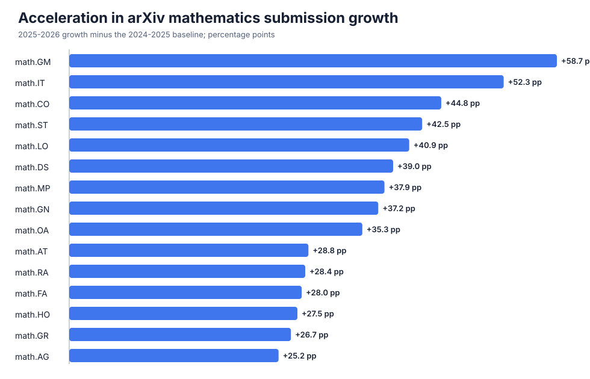

# arXiv Mathematics Trends & Author Explorer

[](https://github.com/guyu168/arxiv-math-trends/actions/workflows/ci.yml)

An auditable arXiv mathematics study with an interactive author explorer. Pick
any start and end date inside the frozen 2010-01-01 to 2026-08-31 snapshot—the
interval must be longer than 15 days—and the browser ranks the 50 most active
normalized author names by paper count.

The repository also compares equal first-half windows (January 1 through June
30) across all 32 arXiv mathematics primary categories.



## Interactive author explorer

The frontend lives in [`web/`](web). Its calculation runs in the browser from
year-partitioned daily snapshots, so the browser downloads only the years needed
for a selected window. Every paper adds one count to each listed author.

The explorer groups contributions by normalized arXiv display name. External
ORCID and OpenAlex records remain in the generated snapshots for audit, but they
do not split the ranking. This keeps fragmented external profiles from breaking
one display name into many rows; conversely, different people publishing under
the same display name can be combined. Each ranked row also shows the three
primary mathematics categories in which that name published the most papers
during the selected period (`PDE` denotes `math.AP`). Legacy primary labels
`cs.IT` and `math-ph` are normalized to `math.IT` and `math.MP`.

The 2010–2023 paper backfill comes from the public arXiv metadata snapshot
mirrored on Hugging Face. The 2024–2026 paper snapshots use the official arXiv
API. OpenAlex/ORCID matches are retained only as auditable auxiliary metadata.

## Aggregate H1 comparison

| Metric | 2024 H1 | 2025 H1 | 2026 H1 |
|---|---:|---:|---:|
| Primary-category papers | 21,734 | 21,818 | 27,312 |
| Year-on-year growth | — | 0.39% | 25.18% |

- 2026 H1 is **25.66%** above 2024 H1.
- The year-on-year growth rate accelerated by **24.79 percentage points** in
  2026.
- Applying the 2024→2025 growth rate once more gives a simple 2026 baseline of
  21,902 papers; the observed count is 5,410 higher. This is descriptive, not a
  causal estimate of an AI effect.

## All mathematics categories

`Δ growth` is `(2026 vs 2025 growth) − (2025 vs 2024 growth)` in percentage
points. The table is sorted by that change.

| Category | Subject | 2024 H1 | 2025 H1 | 2025 vs 2024 | 2026 H1 | 2026 vs 2025 | 2026 vs 2024 | Δ growth |
|---|---|---:|---:|---:|---:|---:|---:|---:|
| math.IT | Information Theory | 1465 | 1128 | -23.00% | 1534 | 35.99% | 4.71% | 59.00 pp |
| math.LO | Logic | 404 | 350 | -13.37% | 495 | 41.43% | 22.52% | 54.79 pp |
| math.CO | Combinatorics | 1962 | 1986 | 1.22% | 2850 | 43.50% | 45.26% | 42.28 pp |
| math.GM | General Mathematics | 168 | 189 | 12.50% | 288 | 52.38% | 71.43% | 39.88 pp |
| math.OA | Operator Algebras | 206 | 198 | -3.88% | 268 | 35.35% | 30.10% | 39.24 pp |
| math.DS | Dynamical Systems | 871 | 831 | -4.59% | 1103 | 32.73% | 26.64% | 37.32 pp |
| math.MP | Mathematical Physics | 619 | 597 | -3.55% | 795 | 33.17% | 28.43% | 36.72 pp |
| math.ST | Statistics Theory | 577 | 568 | -1.56% | 758 | 33.45% | 31.37% | 35.01 pp |
| math.RA | Rings and Algebras | 405 | 372 | -8.15% | 459 | 23.39% | 13.33% | 31.54 pp |
| math.DG | Differential Geometry | 901 | 913 | 1.33% | 1194 | 30.78% | 32.52% | 29.45 pp |
| math.HO | History and Overview | 111 | 109 | -1.80% | 139 | 27.52% | 25.23% | 29.32 pp |
| math.AG | Algebraic Geometry | 1098 | 1106 | 0.73% | 1416 | 28.03% | 28.96% | 27.30 pp |
| math.GN | General Topology | 113 | 104 | -7.96% | 124 | 19.23% | 9.73% | 27.20 pp |
| math.FA | Functional Analysis | 766 | 730 | -4.70% | 889 | 21.78% | 16.06% | 26.48 pp |
| math.AT | Algebraic Topology | 276 | 279 | 1.09% | 355 | 27.24% | 28.62% | 26.15 pp |
| math.SG | Symplectic Geometry | 156 | 130 | -16.67% | 140 | 7.69% | -10.26% | 24.36 pp |
| math.NT | Number Theory | 1249 | 1287 | 3.04% | 1602 | 24.48% | 28.26% | 21.43 pp |
| math.AP | Analysis of PDEs | 2236 | 2308 | 3.22% | 2858 | 23.83% | 27.82% | 20.61 pp |
| math.GR | Group Theory | 501 | 498 | -0.60% | 591 | 18.67% | 17.96% | 19.27 pp |
| math.NA | Numerical Analysis | 1719 | 1775 | 3.26% | 2081 | 17.24% | 21.06% | 13.98 pp |
| math.CA | Classical Analysis and ODEs | 407 | 405 | -0.49% | 458 | 13.09% | 12.53% | 13.58 pp |
| math.GT | Geometric Topology | 452 | 455 | 0.66% | 519 | 14.07% | 14.82% | 13.40 pp |
| math.OC | Optimization and Control | 1998 | 2120 | 6.11% | 2525 | 19.10% | 26.38% | 13.00 pp |
| math.CV | Complex Variables | 324 | 342 | 5.56% | 404 | 18.13% | 24.69% | 12.57 pp |
| math.RT | Representation Theory | 533 | 524 | -1.69% | 581 | 10.88% | 9.01% | 12.57 pp |
| math.PR | Probability | 1206 | 1376 | 14.10% | 1645 | 19.55% | 36.40% | 5.45 pp |
| math.CT | Category Theory | 195 | 195 | 0.00% | 204 | 4.62% | 4.62% | 4.62 pp |
| math.AC | Commutative Algebra | 320 | 319 | -0.31% | 331 | 3.76% | 3.44% | 4.07 pp |
| math.QA | Quantum Algebra | 162 | 183 | 12.96% | 214 | 16.94% | 32.10% | 3.98 pp |
| math.MG | Metric Geometry | 167 | 213 | 27.54% | 252 | 18.31% | 50.90% | -9.24 pp |
| math.KT | K-Theory and Homology | 60 | 63 | 5.00% | 49 | -22.22% | -18.33% | -27.22 pp |
| math.SP | Spectral Theory | 107 | 165 | 54.21% | 191 | 15.76% | 78.50% | -38.45 pp |

## Reproduce the analysis

```bash
python -m venv .venv
source .venv/bin/activate  # Windows: .venv\Scripts\activate
python -m pip install -e .
arxiv-math-trends
python -m unittest discover -s tests -v
```

To rebuild or extend the frozen browser data, run `arxiv-math-harvest` with
optional `--start` and `--end` dates. The harvester caches API pages and waits
between requests in line with arXiv's guidance.

To run the explorer locally:

```bash
cd web
npm install
npm run dev
```

Generated category metrics are written to `outputs/category_metrics.csv`.
See [`data/METHODOLOGY.md`](data/METHODOLOGY.md) for the precise counting rule,
formulas, source, author-name limitations, and confounders.

## Author

Guyu Jin — Graduate School of Mathematical Sciences, The University of Tokyo.

